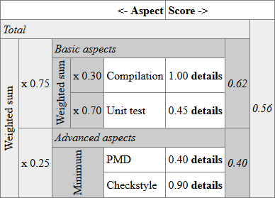

## "Grading hints" - hinting a grader when scoring submissions

**Version 0.8**

ProFormA programming tasks can be assigned a grading scheme with the so-called *grading-hints*. This chapter describes simple and complex grading scheme examples and the XML schema for grading-hints.


### Table of contents

  * [TODOs](#todos)
  * [Abstract](#abstract)
  * [Examples](#examples)
    + [Example 1a. Introducing a simple example](#example-1a-introducing-a-simple-example)
    + [Example 1b. Weighted sub results](#example-1b-weighted-sub-results)
    + [Example 2. A hierarchy of sub results](#example-2-a-hierarchy-of-sub-results)
    + [Example 3. Conditionally nullify scores](#example-3-conditionally-nullify-scores)
    + [Example 4. Referencing tests and sub tests](#example-4-referencing-tests-and-sub-tests)
    + [Example 5. Combining sub tests and nullify conditions](#example-5-combining-sub-tests-and-nullify-conditions)
    + [Example 6. Last: a very simple example](#example-6-last-a-very-simple-example)
  * [XML schema](#xml-schema)
    + [Common elements](#common-elements)
      - [displaytitle element](#displaytitle-element)
      - [description and internal-description elements](#description-and-internal-description-elements)
    + [grading-hints element](#grading-hints-element)
      - [Sub elements of the grading-hints-type](#sub-elements-of-the-grading-hints-type)
    + [root and combine - elements of the grades-node-type](#root-and-combine---elements-of-the-grades-node-type)
      - [Sub elements of the grades-node-type](#sub-elements-of-the-grades-node-type)
      - [Attributes of the grades-node-type](#attributes-of-the-grades-node-type)
    + [test-ref and combine-ref - elements of the grades-base-ref-child-type](#test-ref-and-combine-ref---elements-of-the-grades-base-ref-child-type)
      - [Sub elements of grades-base-ref-child-type common to "test-ref" pointers and "combine-ref" pointers](#sub-elements-of-grades-base-ref-child-type-common-to-test-ref-pointers-and-combine-ref-pointers)
      - [Attributes of grades-base-ref-child-type common to "test-ref" pointers and "combine-ref" pointers](#attributes-of-grades-base-ref-child-type-common-to-test-ref-pointers-and-combine-ref-pointers)
      - [Specific sub elements of the combine-ref element](#specific-sub-elements-of-the-combine-ref-element)
      - [Specific attributes of the combine-ref element](#specific-attributes-of-the-combine-ref-element)
      - [Specific sub elements of the test-ref element](#specific-sub-elements-of-the-test-ref-element)
      - [Specific attributes of the test-ref element](#specific-attributes-of-the-test-ref-element)
    + [nullify-conditions](#nullify-conditions)
      - [Sub elements of the grades-nullify-base-type common to "nullify-condition" and "nullify-conditions"](#sub-elements-of-the-grades-nullify-base-type-common-to-nullify-condition-and-nullify-conditions)
      - [Sub elements of the nullify-conditions element](#sub-elements-of-the-nullify-conditions-element)
      - [Attributes of the nullify-conditions element](#attributes-of-the-nullify-conditions-element)
    + [nullify-condition (without s)](#nullify-condition-without-s)
      - [Sub elements of the nullify-condition element](#sub-elements-of-the-nullify-condition-element)
      - [Attributes of the nullify-condition element](#attributes-of-the-nullify-condition-element)
      - [The nullify-combine-ref element](#the-nullify-combine-ref-element)
      - [The nullify-test-ref element](#the-nullify-test-ref-element)
      - [The nullify-literal element](#the-nullify-literal-element)


      
### TODOs

 - [ ] check reference to Appendix A in [description element](#description-and-internal-description-elements)
 


### Abstract

A grading-hints section of a ProFormA task obtains scores from tests. Most ProFormA tasks define more than one test. Every test in a ProFormA task is expected to generate a score. If a test doesn't generate a score, it will at least generate some output like *passed* or *failed*. Such a binary output can be mapped automatically to values 1 or 0 respectively by graders that support the grading-hints schema. The grading-hints schema is designed to describe, how a grader should calculate a total result from the individual test results.

In fact, many test tools do not generate a single score. E. g. a unit test tool usually executes several test cases for a given task where each test case reports an individual result. In a simple but useful setting, a grader receives a log dump from the test tool that lists all individual test case result. The log dump usually includes an overall *passed* classification if and only if all test cases passed. In a simple setting, the task author takes that overall classification as a single score per test. With this, the author defines a task's grading-hints as a calculation rule based on one score per test.

Nevertheless, the grading-hints element described in this chapter is also capable of calculating a total grading result out of individual test *case* results. For this, so-called *sub test results" may be referenced and included in a calculation rule.

Last but not least, the grading-hints element can define so-called "nullifications". E. g. if the unit test tool reports less than p % of all test cases successful, then a task author might decide not to credit any score for a successfull compilation. If instead at least p % of all test cases passed, the grading-hints could include e. g. a fixed additional score for successful compilation. This way, students cannot "steal" points for compilation by submitting a nearly empty program file. A major design goal for nullifications was, that a student facing a grading result understands the result's calculation mechanics easily.

Grading hints are hints for the grader to calculate an overall score from individual test and sub test scores. But, also a middle ware or a user-connected front end like a learning management system (LMS) could benefit from interpreting the grading hints. For the presentation in this chapter we focus on the grading process and on how individual test and sub test scores are condensed into a total result. As a side note we present possible ways, how to render results to students. Usually it will not suffice to report a simple number. Instead a grader or a front end will have to explain the calculation rules behind that number to the student. That's why the [examples section](#examples) suggests suitable renderings of grading results in order to prove feasibility.

Let's start with a [section of examples](#examples). After that we introduce the [grading-hints XML schema](#xml-schema).

### Examples

#### Example 1a. Introducing a simple example

A typical simple example is as follows:

```xml
<?xml version="1.0" encoding="UTF-8"?>
<tns:grading-hints>
    <tns:root function="sum">
        <tns:test-ref ref="test1"/>
        <tns:test-ref ref="test2"/>
        <tns:test-ref ref="test3"/>
        <tns:test-ref ref="test4"/>
    </tns:root>
</tns:grading-hints>
```

The above simple example calculates the sum of all test-generated scores. From this a grader could produce a scoring result for students like the following:

> Your grade result is composed of several test results:
>
>   * Compilation (test1). Score achieved: 1.0 (passed)
>   
>     \<textual feedback\>
>         
>   * Unit test (test2). Score achieved: 0.45
>   
>     \<textual feedback\>
>         
>   * PMD (test3). Score achieved: 0.4 
>   
>     \<textual feedback\>
>         
>   * Checkstyle (test4). Score achieved: 0.9
>   
>     \<textual feedback\>
>         
> Total score achieved: **2.75**

The titles _Compilation_, _Unit test_, etc. are assumed to be specified in the \<tests\> section of a ProFormA task. The test id printed in parentheses usually would not be included in the report. It is only included in this whitepaper to make the report structure clear.

A tabular representation might even be clearer but lacks the possibility of including detailed feedback directly below the quantitative result. Instead a front end could provide links to detailed textual feedback:

> |         | <- Aspect    |         Score -> |               | 
> |---------|:-------------|-----------------:|--------------:|
> | _Total_ |              |                  | _Total Score_ |
> | Sum of  | Compilation  | 1.00 __details__ |               | 
> |         | Unit test    | 0.45 __details__ |               | 
> |         | PMD          | 0.40 __details__ |               | 
> |         | Checkstyle   | 0.90 __details__ |      **2.75** | 

The **details** could be clickable links that show a popup or that route the user to an anchor in a large HTML document.

Last but not least, a front end could combine both approaches: a tabular representation for an overview and the bullet point list for the details. The __details__ links in the table could lead the user directly to the respective section in the bullet point list.

#### Example 1b. Weighted sub results

Let's make the example a bit more complex by weighting test results individually:

```xml
<?xml version="1.0" encoding="UTF-8"?>
<tns:grading-hints>
    <tns:root function="sum">
        <tns:test-ref weight="0.33" ref="test1"/>
        <tns:test-ref weight="0.20" ref="test2"/>
        <tns:test-ref weight="0.17" ref="test3"/>
        <tns:test-ref weight="0.30" ref="test4"/>
    </tns:root>
</tns:grading-hints>
```

This specifies a weighted sum out of all test-generated scores. The weights have been chosen to add up to 1.0 in order to get a weighted average. The grading-hints XML schema does recommend but not require weights adding up to 1. 

A front end might present a result like this:

> |                 |        | <- Aspect    |         Score -> |               | 
> |-----------------|-------:|:-------------|-----------------:|--------------:|
> | _Total_         |        |              |                  | _Total Score_ |
> | Weighted sum of | x 0.33 | Compilation  | 1.00 __details__ |               | 
> |                 | x 0.20 | Unit test    | 0.45 __details__ |               | 
> |                 | x 0.17 | PMD          | 0.40 __details__ |               | 
> |                 | x 0.30 | Checkstyle   | 0.90 __details__ |      **0.76** | 

Note the additional column with factors (marked with the multiplication sign "x") and the term _Weighted Sum_ in the left column.

#### Example 2. A hierarchy of sub results

Most tasks, but probably not all tasks, would consider the above configuration options to be adequate. But sometimes a task author needs more options. Consider a slightly more complicated setup that identifies different learning goals covered by different tests. E. g. test1 and test2 are considered tests that check the basic functionality of the submission, test3 and test4 are about advanced style and maintainability aspects of the solution. A task author would like to provide a global weighting scheme balancing basic and advanced aspects. Also the author would penalize errors in advanced aspects harder by taking the minimum score of test3 and test4. This would look like:

```xml
<?xml version="1.0" encoding="UTF-8"?>
<tns:grading-hints xmlns:tns="urn:proforma:grades:v0.8">
    <tns:root function="sum">
        <tns:displaytitle>Total</tns:displaytitle>
        <tns:combine-ref weight="0.75" ref="basic"/>
        <tns:combine-ref weight="0.25" ref="advanced"/>
    </tns:root>
    <tns:combine id="basic" function="sum">
        <tns:displaytitle>Basic aspects</tns:displaytitle>
        <tns:test-ref weight="0.3" ref="test1"/>
        <tns:test-ref weight="0.7" ref="test2"/>
    </tns:combine>
    <tns:combine id="advanced" function="min">
        <tns:displaytitle>Advanced aspects</tns:displaytitle>
        <tns:test-ref ref="test3"/>
        <tns:test-ref ref="test4"/>
    </tns:combine>
</tns:grading-hints>
```

The above grading prescription defines a tree consisting of three inner nodes and four leaves.

                        +--------+
                 +------+  root  +--------+
                 |      +--------+        |
                 |                        |
         +-------+--+               +-----+----+
         |  basic   |               | advanced |
         ++-------+-+               +-+-------++
          |       |                   |       |
    +-----+-+   +-+-----+       +-----+-+   +-+-----+
    | test1 |   | test2 |       | test3 |   | test4 |
    +-------+   +-------+       +-------+   +-------+
    
The inner nodes at the medium level are ``combine`` nodes that define an accumulator function like sum, min, max or avg. Every node except the root can define a weight that will be multiplied when accumulating the result of that node to its parent node. Leave nodes are referring tests. In order to allow labeling of intermediate results at inner nodes, every inner node may get a ``displaytitle`` element. A front-end could present a result for this grading scheme in tabular form like this:

> |                 |        |                    |        | <- Aspect   |         Score -> |                           |                |
> |-----------------|-------:|--------------------|-------:|-------------|-----------------:|--------------------------:|---------------:|
> | _Total_         |        |                    |        |             |                  |                           |  _Total Score_ |
> | Weighted sum of | x 0.75 | _Basic aspects_    |        |             |                  |     _Basic aspects Score_ |                |
> |                 |        | Weighted sum of    | x 0.30 | Compilation | 1.00 __details__ |                           |                |
> |                 |        |                    | x 0.70 | Unit test   | 0.45 __details__ |                      0.62 |                |
> |                 | x 0.25 | _Advanced aspects_ |        |             |                  |  _Advanced aspects Score_ |                |
> |                 |        | Minimum of         |        | PMD         | 0.40 __details__ |                           |                |
> |                 |        |                    |        | Checkstyle  | 0.90 __details__ |                      0.40 |       **0.56** |

In a rich formatting language like HTML there would be more formatting options than in markdown. E. g. a ``colspan`` around the four cells heading east starting from _Basic aspects_ or from _Advanced aspects_ would make relationships clear. Also a ``rowspan`` around the six cells heading south starting from the upper left _Weighted sum of_ cell would work out clearly the extent of the weighted sum. An example look is given in the following image or in the file ``images/whitepaper-grades-img1.png``:



#### Example 3. Conditionally nullify scores

Let's build upon the [previous example](#example-2-a-hierarchy-of-sub-results). A teacher or a task author wants to nullify scores for advanced aspects if the basic aspects do not exceed a certain threshold. This seems reasonable when we take a closer look at static code analysis tools that often count rule violations. A student can achieve high scores in test3 and test4 when submitting a minimal program that has near to zero functionality. For this, the task author includes a _nullify condition_ at the child reference to the ``advanced`` child:

```xml
<?xml version="1.0" encoding="UTF-8"?>
<tns:grading-hints xmlns:tns="urn:proforma:grades:v0.8">
    <tns:root function="sum">
        <tns:displaytitle>Total</tns:displaytitle>
        <tns:combine-ref weight="0.75" ref="basic"/>
        <tns:combine-ref weight="0.25" ref="advanced">
            <tns:nullify-condition compare-op="le">
                <tns:nullify-combine-ref ref="basic"/>
                <tns:nullify-literal value="0.8"/>
            </tns:nullify-condition>
        </tns:combine-ref>
    </tns:root>
    <tns:combine id="basic" function="sum">
        <tns:displaytitle>Basic aspects</tns:displaytitle>
        <tns:test-ref weight="0.3" ref="test1"/>
        <tns:test-ref weight="0.7" ref="test2"/>
    </tns:combine>
    <tns:combine id="advanced" function="min">
        <tns:displaytitle>Advanced aspects</tns:displaytitle>
        <tns:test-ref ref="test3"/>
        <tns:test-ref ref="test4"/>
    </tns:combine>
</tns:grading-hints>
```

This way we attached a nullify condition to the tree edge between the ``root`` node and the ``advanced`` node. If the nullify condition evaluates to _true_, then the respective subresult for the subtree rooted at ``advanced`` is assumed 0. Looking at the specified condition in detail, the author requires an intermediate score of at most (``le`` = *l*ess than or *e*quals) 0.8 at the ``basic`` node. Our example submission reached 0.62, i. e. this submission would get nullified in advanced aspects.

The nullify condition extends the topology by an arrow from ``basic`` to the edge at the upper right as shown in the following graphic:

                             +--------+
               +-------------+  root  +------------+
               |             +--------+            |
               |                                   |
               |                          +-------(|
               |                          |        |
         +-----+----+   nullify if <=0.8  |   +----+-----+
         |  basic   +<--------------------+   | advanced |
         ++-------+-+                         +-+-------++
          |       |                             |       |
    +-----+-+   +-+-----+                 +-----+-+   +-+-----+
    | test1 |   | test2 |                 | test3 |   | test4 |
    +-------+   +-------+                 +-------+   +-------+

A possible presentation of a submission result is the following, which deviates from the previous example in the last row in the two right-most columns: 


> |                 |        |                    |        | <- Aspect   |         Score -> |                           |                |
> |-----------------|-------:|--------------------|-------:|-------------|-----------------:|--------------------------:|---------------:|
> | _Total_         |        |                    |        |             |                  |                           |  _Total Score_ |
> | Weighted sum of | x 0.75 | _Basic aspects_    |        |             |                  |     _Basic aspects Score_ |                |
> |                 |        | Weighted sum of    | x 0.30 | Compilation | 1.00 __details__ |                           |                |
> |                 |        |                    | x 0.70 | Unit test   | 0.45 __details__ |                      0.62 |                |
> |                 | x 0.25 | _Advanced aspects_ |        |             |                  |  _Advanced aspects Score_ |                |
> |                 |        | Minimum of         |        | PMD         | 0.40 __details__ |                           |                |
> |                 |        |                    |        | Checkstyle  | 0.90 __details__ |  0.40 -> 0.00 __details__ |       **0.46** |


In the cell with the _Advanced aspects_'s score the nullification could be represented by an arrow. The submitter could get a detailed explanation by clicking on _details_. The explanation could even be generated automatically like 

> When calculating the _Total Score_ your _Advanced aspects Score_ was nullified. Reason: _Basic aspects_ should be \> 0.8, but was 0.62.

The grading-hints schema allows nullification with a simple comparison like above using any of the common numerical comparators. Also an author can build composite conditions by combing simple conditions in an and-or-tree.

#### Example 4. Referencing tests and sub tests

Sometimes test granularity is too coarse grained when coming to grades. From the test tool's point of view it makes sense to execute e.g. all test cases in a unit test suite at once in a single tool pass. But, in a grading scheme the various different test aspects of the individual test cases might deserve a differentiate interpretation. We build upon the [above example without nullification but with a three-leveled tree](#example-2-a-hierarchy-of-sub-results). Let's assume, the unit test ``test2`` executes a test suite of two test cases. The first test case labeled ``tc.a`` is considered a basic aspect while the second test case ``tc.b`` is advanced. (Another example could concern two violation rules in a static code analysis tool, but let's stick to the unit test example so as not to complicate it.) 

```xml
<?xml version="1.0" encoding="UTF-8"?>
<tns:grading-hints xmlns:tns="urn:proforma:grades:v0.8">
    <tns:root function="sum">
        <tns:displaytitle>Total</tns:displaytitle>
        <tns:combine-ref weight="0.75" ref="basic"/>
        <tns:combine-ref weight="0.25" ref="advanced"/>
    </tns:root>
    <tns:combine id="basic" function="sum">
        <tns:displaytitle>Basic aspects</tns:displaytitle>
        <tns:test-ref weight="0.3" ref="test1"/>
        <tns:test-ref weight="0.7" ref="test2" sub-ref="tc.a">
            <tns:displaytitle>Unit test, aspect A</tns:displaytitle>
        </tns:test-ref>
    </tns:combine>
    <tns:combine id="advanced" function="min">
        <tns:displaytitle>Advanced aspects</tns:displaytitle>
        <tns:test-ref ref="test2" sub-ref="tc.b">
            <tns:displaytitle>Unit test, aspect B</tns:displaytitle>
        </tns:test-ref>
        <tns:test-ref ref="test3"/>
        <tns:test-ref ref="test4"/>
    </tns:combine>
</tns:grading-hints>
```

In the above example the task author placed ``tc.b`` below ``advanced`` while placing ``tc.a`` below ``basic``. Since the title of the \<test\> element in the ProFormA task can not be used, the author added a specific title for each referenced sub test.

The following illustrates the topology of this grading scheme:

                        +--------+
                 +------+  root  +--------+
                 |      +--------+        |
                 |                        |
         +-------+--+               +-----+-------------------+
         |  basic   |               | advanced                |
         ++-------+-+               +-+------------+--------+-+
          |       |                   |            |        |
    +-----+-+   +-+----------+   +----+-------+ +--+----+ +-+-----+
    | test1 |   | test2/tc.a |   | test2/tc.b | | test3 | | test4 |
    +-------+   +------------+   +------------+ +-------+ +-------+

The front end representation of a submission result depicts the specific sub test titles:

> |                 |        |                    |        | <- Aspect           |         Score -> |                           |                |
> |-----------------|-------:|--------------------|-------:|---------------------|-----------------:|--------------------------:|---------------:|
> | _Total_         |        |                    |        |                     |                  |                           |  _Total Score_ |
> | Weighted sum of | x 0.75 | _Basic aspects_    |        |                     |                  |     _Basic aspects Score_ |                |
> |                 |        | Weighted sum of    | x 0.30 | Compilation         | 1.00 __details__ |                           |                |
> |                 |        |                    | x 0.70 | Unit test, aspect A | 0.15 __details__ |                      0.41 |                |
> |                 | x 0.25 | _Advanced aspects_ |        |                     |                  |  _Advanced aspects Score_ |                |
> |                 |        | Minimum of         |        | Unit test, aspect B | 0.75 __details__ |                           |                |
> |                 |        |                    |        | PMD                 | 0.40 __details__ |                           |                |
> |                 |        |                    |        | Checkstyle          | 0.90 __details__ |                      0.40 |       **0.40** |
    
    
    
A caveat: The labels ``tc.a`` and ``tc.b`` are specific to the test tool. The proposed grading scheme assumes, that the test tool provides an indexed result such that when calculating grades we can randomly access each sub result. Since the grading scheme hard-codes test-tool-specific sub-result-labels, such a grading scheme has a lower chance to be exchanged between graders, especially between different test tool backends.

#### Example 5. Combining sub tests and nullify conditions

An author can combine sub test references and test references. As an example we extend the [previous example](#example-4-referencing-tests-and-sub-tests). The author wants to nullify the score from the compilation test when all unit test cases miss the bar "0.5". For this in the following example the author adds one additional ``combine`` node labeld ``test2.max`` expressing the maximum of all unit test cases. With the new ``test2.max`` node it is easy to nullify the ``test1`` result, if the ``test2.max`` value is less than 0.5:

```xml
<?xml version="1.0" encoding="UTF-8"?>
<tns:grading-hints xmlns:tns="urn:proforma:grades:v0.8">
    <tns:root function="sum">
        <tns:displaytitle>Total</tns:displaytitle>
        <tns:combine-ref weight="0.75" ref="basic"/>
        <tns:combine-ref weight="0.25" ref="advanced"/>
    </tns:root>
    <tns:combine id="basic" function="sum">
        <tns:displaytitle>Basic aspects</tns:displaytitle>
        <tns:test-ref weight="0.3" ref="test1">
            <tns:nullify-condition compare-op="lt">
                <tns:nullify-combine-ref ref="test2.max"/>
                <tns:nullify-literal value="0.5"/>
            </tns:nullify-condition>
        </tns:test-ref>
        <tns:test-ref weight="0.7" ref="test2" sub-ref="tc.a">
            <tns:displaytitle>Unit test, aspect A</tns:displaytitle>
        </tns:test-ref>
    </tns:combine>
    <tns:combine id="advanced" function="min">
        <tns:displaytitle>Advanced aspects</tns:displaytitle>
        <tns:test-ref ref="test2" sub-ref="tc.b">
            <tns:displaytitle>Unit test, aspect B</tns:displaytitle>
        </tns:test-ref>
        <tns:test-ref ref="test3"/>
        <tns:test-ref ref="test4"/>
    </tns:combine>
    <tns:combine id="test2.max" function="max">
        <tns:displaytitle>Best result of all unit test aspects</tns:displaytitle>
        <tns:test-ref ref="test2" sub-ref="tc.a"/>
        <tns:test-ref ref="test2" sub-ref="tc.b"/>
    </tns:combine>
</tns:grading-hints>
```

The topology shows the following graphic. There is a node ``test.max`` not connected to the root via ordinary tree edges. The only purpose of the tree rooted at ``test2.max`` is a nullification condition of the edge between ``basic`` and ``test1``.

                                                             +--------+
                                                      +------+  root  +--------+
                                                      |      +--------+        |
                                                      |                        |
          +-----------+   nullify if <0.5     +-------+--+               +-----+-------------------+
          | test2.max +<---------+            |  basic   |               | advanced                |
          ++-------+--+          |            ++-------+-+               +-+------------+--------+-+
           |       |             |             |       |                   |            |        |
    +------+---+  ++---------+   +------------(|       |                   |            |        |
    |test2/tc.a|  |test2/tc.b|                 |       |                   |            |        |
    +----------+  +----------+           +-----+-+   +-+----------+   +----+-------+ +--+----+ +-+-----+
                                         | test1 |   | test2/tc.a |   | test2/tc.b | | test3 | | test4 |
                                         +-------+   +------------+   +------------+ +-------+ +-------+


A possible representation in a front end is as follows. It does deviate from the previous one in a single cell at row 4, column 6:

> |                 |        |                    |        | <- Aspect           |                 Score -> |                           |                |
> |-----------------|-------:|--------------------|-------:|---------------------|-------------------------:|--------------------------:|---------------:|
> | _Total_         |        |                    |        |                     |                          |                           |  _Total Score_ |
> | Weighted sum of | x 0.75 | _Basic aspects_    |        |                     |                          |     _Basic aspects Score_ |                |
> |                 |        | Weighted sum of    | x 0.30 | Compilation         | 1.00 -> 1.00 __details__ |                           |                |
> |                 |        |                    | x 0.70 | Unit test, aspect A |         0.15 __details__ |                      0.41 |                |
> |                 | x 0.25 | _Advanced aspects_ |        |                     |                          |  _Advanced aspects Score_ |                |
> |                 |        | Minimum of         |        | Unit test, aspect B |         0.75 __details__ |                           |                |
> |                 |        |                    |        | PMD                 |         0.40 __details__ |                           |                |
> |                 |        |                    |        | Checkstyle          |         0.90 __details__ |                      0.40 |       **0.40** |

The Compilation Score does not get nullified, because the maximum of tc.a and tc.b scores is \>= 0.5. The user could get the following, automatically generated explanation when clicking on the __details__ link besides the "1.00 -\> 1.00" mark:

> When calculating the _Basic aspects Score_ your _Compilation Score_ was not nullified. Reason: _Best result of all unit test aspects_ should be \>= 0.5 and was 0.75.

If deemed necessary, the explanation could be extended by an extra table that explains the calculation of ``test2.max``'s score, but usually a carefully chosen display title for the ``test.max`` node might be less confusing.

By the way: the same effect of nullifying the compilation score when the best unit test result is less than 0.5 could have been reached by a composite nullify condition.

```xml
<?xml version="1.0" encoding="UTF-8"?>
<tns:grading-hints xmlns:tns="urn:proforma:grades:v0.8">
    <tns:root function="sum">
        <tns:displaytitle>Total</tns:displaytitle>
        <tns:combine-ref weight="0.75" ref="basic"/>
        <tns:combine-ref weight="0.25" ref="advanced"/>
    </tns:root>
    <tns:combine id="basic" function="sum">
        <tns:displaytitle>Basic aspects</tns:displaytitle>
        <tns:test-ref weight="0.3" ref="test1">
            <tns:nullify-conditions compose-op="and">
                <tns:displaytitle>Compilation score gets nullified when all unit tests miss 0.5</tns:displaytitle>
                <tns:description><![CDATA[Students are not allowed to <em>steal</em> compilation points by submitting fake programs with near-to-zero functionality. That's why compilation score gets nullified when there is no successful unit test.]]></tns:description>
                <tns:nullify-condition compare-op="lt">
                    <tns:nullify-test-ref ref="test2" sub-ref="tc.a"/>
                    <tns:nullify-literal value="0.5"/>
                </tns:nullify-condition>
                <tns:nullify-condition compare-op="lt">
                    <tns:nullify-test-ref ref="test2" sub-ref="tc.b"/>
                    <tns:nullify-literal value="0.5"/>
                </tns:nullify-condition>
            </tns:nullify-conditions>
        </tns:test-ref>
        <tns:test-ref weight="0.7" ref="test2" sub-ref="tc.a">
            <tns:displaytitle>Unit test, aspect A</tns:displaytitle>
        </tns:test-ref>
    </tns:combine>
    <tns:combine id="advanced" function="min">
        <tns:displaytitle>Advanced aspects</tns:displaytitle>
        <tns:test-ref ref="test2" sub-ref="tc.b">
            <tns:displaytitle>Unit test, aspect B</tns:displaytitle>
        </tns:test-ref>
        <tns:test-ref ref="test3"/>
        <tns:test-ref ref="test4"/>
    </tns:combine>
</tns:grading-hints>
```

This time the user could get the following detail information, that can be generated automatically from the grading scheme:

> **Compilation score gets nullified when all unit tests miss 0.5**
>
> Students are not allowed to *steal* compilation points by submitting fake programs with near-to-zero functionality. That's why compilation score gets nullified when there is no successful unit test.
> 
> When calculating the _Basic aspects Score_ your _Compilation Score_ was __not__ nullified. 
> 
> Reason: At least one of the following conditions was True:
>
>   - _Unit test, aspect A_ should be \>= 0.5 and was 0.15.
>   - _Unit test, aspect B_ should be \>= 0.5 and was 0.75.

The advantage of this approach is that of saving on an additional tree node. It depends on the task and the condition, whether an additional (reusable) tree node is better suited or the (nestable) composite nullify conditions. 

The last example demonstrates using a description element in the nullify-conditions element. The ProFormA grading-hints can define many descriptions at various places. All descriptions are in HTML format.

#### Example 6. Last: a very simple example

Having seen so many complicated examples, we should state, that most tasks do not need to specify anything complex. The following is the simplest grading-hints element possible:

```xml
<?xml version="1.0" encoding="UTF-8"?>
<tns:grading-hints>
    <tns:root/>
</tns:grading-hints>
```

When calculating grades based on these simple grading-hints, all \<test\> element's scores are obtained and the minimum score will be the result. In other words the grading result will be _passed_ if and only if all tests passed.

### XML schema

#### Common elements

There are some basic elements that are repeated at various places in the XML schema. First we describe these basic, somewhat supporting elements. [After that](#grading-hints-element) we start by describing the root \<grading-hints\> element.

##### displaytitle element

    <xs:element name="displaytitle" type="xs:string" minOccurs="0">

A not too long title to be shown above e. g. a grading result. All displaytitle elements in this XML schema are optional. If a displaytitle is given, where a referenced element also has a title, the \<displaytitle\> content overrides the referenced title.

The displaytitle is plain text without formatting. White space in the title will be rendered as with CSS2 style ``white-space:normal``, i. e. sequences of white space are collapsed and lines get broken as necessary to fill line boxes.

##### description and internal-description elements

    <xs:simpleType name="description-type">
        <xs:restriction base="xs:string" />
    </xs:simpleType>

    ...
    
    <xs:element name="description" type="tns:description-type" minOccurs="0" />
    <xs:element name="internal-description" type="tns:description-type" minOccurs="0" />

An instance of this element contains a description as text. A subset of HTML is allowed (see Appendix A). If a description is given, where a referenced element also has a description, the \<description\> content overrides the referenced description.

Descriptions can be given to problem aspects and to nullify conditions (see below).

Internal descriptions are meant for teachers and maybe grading assistants. Internal descriptions are not shown to students. Internal descriptions could include didactic background information and possibly technical or organizational details about the described artifact.


#### grading-hints element

The XML schema of the grading-hints element starts with the root element \<grading-hints\>. The respective section of the XML schema definition (xsd) is:

    <xs:element name="grading-hints" type="tns:grading-hints-type">
        ... keys omitted from this documentation ...
    </xs:element>

The \<grading-hints\> element includes the complete hierarchical grading scheme with all tests references, weights, accumulating functions and nullify conditions. Hierarchy nodes and conditions can get a displaytitle and descriptions. All information below this element except the root node is optional. Grader-specific hints from other XML namespaces can be included in xs:any elements.


    <xs:complexType name="grading-hints-type">
        <xs:sequence>
            <xs:element name="root" type="tns:grades-node-type" />
            <xs:element name="combine" type="tns:grades-node-type" minOccurs="0" maxOccurs="unbounded" />
            <xs:any namespace="##other" minOccurs="0" maxOccurs="unbounded" processContents="lax" />
        </xs:sequence>
    </xs:complexType>

##### Sub elements of the grading-hints-type

The grading-hints-type consist of the following elements

  - **root**

    The [\<root\>](#root-and-combine---elements-of-the-grades-node-type) element ist the root node of the grading scheme hierarchy. If no children are specified, the total grading score will be obtained by including all test results scores. The "function" attribute specifies the accumulator function.

  - **combine**

    The [\<combine\>](#root-and-combine---elements-of-the-grades-node-type) element ist an inner node of the grading scheme hierarchy, that is either an immediate child of the root node or any descendant node. A \<combine\> node specifies how to condense several sub results. Sub results can be test results or again "combined" results.

  - **##other**
  
    This holds any non-standard information that can be used by a grader or humans to calculate a total result from tests results.


#### root and combine - elements of the grades-node-type

The above \<root\> and \<combine\> elements both are of the following grades-node-type:

    <xs:complexType name="grades-node-type">
        <xs:sequence>
            <xs:element name="displaytitle" type="xs:string" minOccurs="0"/>
            <xs:element name="description" type="tns:description-type" minOccurs="0"/>
            <xs:element name="internal-description" type="tns:description-type" minOccurs="0"/>
            <xs:choice minOccurs="0" maxOccurs="unbounded">
                <xs:element name="test-ref" type="tns:grades-test-ref-child-type" />
                <xs:element name="combine-ref" type="tns:grades-combine-ref-child-type" />
            </xs:choice>
        </xs:sequence>
        <xs:attribute name="id" type="xs:string" use="optional"/>
        <xs:attribute name="function" use="optional" default="min">
            <xs:simpleType>
                <xs:restriction base="xs:string">
                    <xs:enumeration value="min"/>
                    <xs:enumeration value="max"/>
                    <xs:enumeration value="sum"/>
                    <xs:enumeration value="avg"/>
                </xs:restriction>
            </xs:simpleType>
        </xs:attribute>
    </xs:complexType>

The grades-node-type represents an inner node of the grading scheme hierarchy. There are only two types of inner nodes: the "root" node and "combine" nodes.

##### Sub elements of the grades-node-type

 - **displaytitle**
 
   A not too long title to be shown above the grading result represented by this node.
   
 - **description**
 
   A more or less comprehensive description of the problem aspect represented by this node.
   
 - **internal-description**
 
   A more or less comprehensive internal description of the problem aspect represented by this node. 
   
 - **test-ref**
 
   A [\<test-ref\>](#test-ref-and-combine-ref---elements-of-the-grades-base-ref-child-type) points to the ``id`` attribute of a \<test\> element in a ProFormA task. As such the result of the pointed at test is obtained and included in a bottom-up fashion in the calculation of the total result.
   
 - **combine-ref**
 
   A [\<combine-ref\>](#test-ref-and-combine-ref---elements-of-the-grades-base-ref-child-type) points to the ``id`` attribute of a \<combine\> element in the grading scheme hierarchy. As such the result of the pointed at node is obtained and included in a bottom-up fashion in the calculation of the total result.
   

##### Attributes of the grades-node-type

 - **id**
 
   Node identifier. It is optional for the \<root\> node and required for \<combine\> nodes.
   
 - **function**
 
   Accumulator function that is used to condense several sub results to a single result. Currently there are four functions to choose from:
   
   * **min**
     
     Specifies the minimum of several sub scores. This can be used in an "all or nothing" situation, where a parent score should reflect the worst of the child results. Weights can be attached to children to express the valency of a child's result. The child node representing the easiest aspect among its siblings could get the weight 1. Child nodes for grading aspects connected with a higher effort represent scores that are more difficult to achieve. These child nodes could get weights larger than 1. This would guarantee, that when all child nodes results are in [0,1] also the parent node result is in [0,1].
     
   * **max**
   
     Specifies the maximum of several sub scores. This is used in an "one success is enough" situation, where a parent score should reflect the best of the child results. An example is a task or a graded problem aspect that could be solved in different ways and for each way there is a separate test element in the task. A solution that succeeds any one of these tests is regarded successful. If one of the different ways of solving the task is more sophisticated than the others, the respective child test could get the highest weight 1. Easier, less valent solution paths get lower weights between 0 and 1. This would guarantee, that when all child nodes results are in [0,1] also the parent node result is in [0,1].
     
   - **sum**
   
     Specifies the sum of several sub scores. This is used in a situation, where every child represents a problem aspect that could be solved more or less independently of the other aspects. Weights can be attached to child nodes. Those child nodes representing easy problem aspects could get lower weights than other aspects. If all weights of all direct children of a node add up to 1, this would guarantee, that the parent node result is in [0,1] when all child nodes results are in [0,1].
     
   - **avg**
   
     Specifies the arithmetic mean of several sub scores. This is the special case of a sum with equal weights for every child while all weights add up to 1. Child nodes of an "avg"-node should not get any weights because in that case weights are ignored.
     
     
#### test-ref and combine-ref - elements of the grades-base-ref-child-type

The above \<combine-ref\> and \<test.ref\> elements both are derived from the following grades-base-ref-child-type. The respective section of the XML schema is here:

    <xs:complexType name="grades-base-ref-child-type">
        <xs:sequence>
            <xs:choice minOccurs="0">
                <xs:element name="nullify-conditions" type="tns:grades-nullify-conditions-type" />
                <xs:element name="nullify-condition" type="tns:grades-nullify-condition-type" />
            </xs:choice>
        </xs:sequence>
        <xs:attribute name="weight" type="xs:double" use="optional" />
    </xs:complexType>
    <xs:complexType name="grades-test-ref-child-type">
        <xs:complexContent>
            <xs:extension base="tns:grades-base-ref-child-type">
                <xs:sequence>
                    <xs:element name="displaytitle" type="xs:string" minOccurs="0"/>
                    <xs:element name="description" type="tns:description-type" minOccurs="0"/>
                    <xs:element name="internal-description" type="tns:description-type" minOccurs="0"/>
                </xs:sequence>
                <xs:attribute name="ref" type="xs:string" use="required"/>
                <xs:attribute name="sub-ref" type="xs:string" use="optional"/>
            </xs:extension>
        </xs:complexContent>
    </xs:complexType>
    <xs:complexType name="grades-combine-ref-child-type">
        <xs:complexContent>
            <xs:extension base="tns:grades-base-ref-child-type">
                <xs:attribute name="ref" type="xs:string" use="required"/>
            </xs:extension>
        </xs:complexContent>
    </xs:complexType>

The grades-base-ref-child-type represents pointers from inner nodes of the grading scheme hierarchy to children. There are two kinds of pointers: "test-ref" pointers and "combine-ref" pointers.

We first discuss the common elements of both kinds of pointers.

##### Sub elements of grades-base-ref-child-type common to "test-ref" pointers and "combine-ref" pointers

 - **nullify-conditions**
 
   Specifies a [composite condition](#nullify-conditions) when the sub result of the pointed-at node should get nullified. The pointed-at node is a test or a combine node. If the composite condition evaluates to False, it has no effect. Otherwise, the score of the pointed-at node is _not_ accumulated into the condensed result of the pointing-from-node. State differently, the score that flows into the accumulator function of the pointing-from-node, is assumed to be emitted as 0 from the pointed-at node.
   
 - **nullify-condition**
 
   Specifies a [_comparison_ condition](#nullify-condition-without-s) when the sub result of the pointed-at node should get nullified. The only difference to \<nullify-conditions\> is the trailing "s" and the fact, that \<nullify-conditions\> represents a composite condition while \<nullify-condition\> represents a simple comparison condition.
   
##### Attributes of grades-base-ref-child-type common to "test-ref" pointers and "combine-ref" pointers

 - **weight**
 
   Specifies a weight that is multiplied to the sub result of the pointed-at node when flowing into the accumulator function. The pointed-at node is a test or a combine node. When calculating the condensed result for the pointing-from node, the score of the pointed-at node is multiplied by the weight, if present. Otherwise nothing is multiplied. A special case is together with the accumulator function _avg_ where possibly attributed weights are completely ignored.

      
##### Specific sub elements of the combine-ref element

Currently there are no specific sub elements in a combine-ref element.

##### Specific attributes of the combine-ref element

 - **ref**
 
   The id of the pointed-at combine node.
    
    
##### Specific sub elements of the test-ref element

 - **displaytitle**
   
   A not too long title to be shown above the pointed-at test's result. Overrides the title of the pointed-at test element. This can be used especially when pointing to sub test results.
   
 - **description**
 
   A more or less comprehensive description of the problem aspect represented by the pointed-at test. This can be used especially when pointing to sub test results.
   
 - **internal-description**
 
   A more or less comprehensive internal description of the problem aspect represented by the pointed-at test. This can be used especially when pointing to sub test results.
   
 
##### Specific attributes of the test-ref element

 - **ref**
 
   The id of the pointed-at test.
   
 - **sub-ref**
 
   If the pointed at test exhibits sub test results, this points to one of the sub results. Examples are individual test cases in a unit test specification, individual violation rules in a static code analyzer, individual error classes in a compilation step, etc. Since the sub-ref format or content is test-tool-specific, it is not normed in the ProFormA format.
   
   
    
#### nullify-conditions

A \<nullify-conditions\> element specifies a composite condition when the sub result of a pointed-at node should get nullified. The composite condition is attributed with one of the boolean operators { and, or }. Further it contains operands that usually are of the nullify-condition type, which represents a simple comparison. Nevertheless a composite condition can have nested composite conditions as operands as well.

    <xs:complexType name="grades-nullify-base-type">
        <xs:sequence>
            <xs:element name="displaytitle" type="xs:string" minOccurs="0" />
            <xs:element name="description" type="tns:description-type" minOccurs="0" />
            <xs:element name="internal-description" type="tns:description-type" minOccurs="0" />
        </xs:sequence>
    </xs:complexType>
    <xs:complexType name="grades-nullify-conditions-type">
        <xs:complexContent>
            <xs:extension base="tns:grades-nullify-base-type">
                <xs:sequence>
                    <xs:choice minOccurs="2" maxOccurs="unbounded">
                        <xs:element name="nullify-conditions" type="tns:grades-nullify-conditions-type" />
                        <xs:element name="nullify-condition" type="tns:grades-nullify-condition-type" />
                    </xs:choice>
                </xs:sequence>
                <xs:attribute name="compose-op" use="required">
                    <xs:simpleType>
                        <xs:restriction base="xs:string">
                            <xs:enumeration value="and" />
                            <xs:enumeration value="or" />
                        </xs:restriction>
                    </xs:simpleType>
                </xs:attribute>
            </xs:extension>
        </xs:complexContent>
    </xs:complexType>
    

##### Sub elements of the grades-nullify-base-type common to "nullify-condition" and "nullify-conditions"

 - **displaytitle**
   
   A title to be displayed when explaining a score nullification to students or teachers. Front ends might decide to explain nullification conditions in a grading scheme even if for a certain submission no nullification took place. An example is given above in the examples section.
   
 - **description**
 
   A detailed description to be displayed when explaining a score nullification. Front ends might decide to extend this description by an automatically generated, human readable version of the involved boolean expression.
   
 - **internal-description**
 
   A detailed description to be displayed to teachers and grading assistants only.

##### Sub elements of the nullify-conditions element
   
 - **nullify-conditions**
 
   An operand of the boolean expression, itself being a composite condition.
   
 - **nullify-condition**
   
   A simple [comparison condition](#nullify-condition-without-s) as an operand of the boolean expression.
   
   
##### Attributes of the nullify-conditions element

 - **compose-op**
 
   The boolean operator of the boolean expression. Currently the two operators { and, or } are supported.
   

#### nullify-condition (without s)

Specifies a simple comparison condition when the sub result of a pointed-at node should get nullified. This simple comparison condition is [attributed with one of the six common comparison operators](#attributes-of-the-nullify-condition-element). Further it contains operands that refer to [tests](#the-nullify-test-ref-element) or [combine nodes](#the-nullify-combine-ref-element) or that specify a [numerical constant](#the-nullify-literal-element), which a result should be compared to.

    <xs:complexType name="grades-nullify-condition-type">
        <xs:complexContent>
            <xs:extension base="tns:grades-nullify-base-type">
                <xs:sequence>
                    <xs:choice minOccurs="2" maxOccurs="2">
                        <xs:element name="nullify-combine-ref" type="tns:grades-nullify-combine-ref-type" />
                        <xs:element name="nullify-test-ref" type="tns:grades-nullify-test-ref-type" />
                        <xs:element name="nullify-literal" type="tns:grades-nullify-literal-type" />
                    </xs:choice>
                </xs:sequence>
                <xs:attribute name="compare-op" use="required">
                    <xs:simpleType>
                        <xs:restriction base="xs:string">
                            <xs:enumeration value="eq" />
                            <xs:enumeration value="ne" />
                            <xs:enumeration value="gt" />
                            <xs:enumeration value="ge" />
                            <xs:enumeration value="lt" />
                            <xs:enumeration value="le" />
                        </xs:restriction>
                    </xs:simpleType>
                </xs:attribute>
            </xs:extension>
        </xs:complexContent>
    </xs:complexType>
    <xs:complexType name="grades-nullify-comparison-operand-type">
    </xs:complexType>
    <xs:complexType name="grades-nullify-combine-ref-type">
        <xs:complexContent>
            <xs:extension base="tns:grades-nullify-comparison-operand-type">
                <xs:attribute name="ref" type="xs:string" use="required" />
            </xs:extension>
        </xs:complexContent>
    </xs:complexType>
    <xs:complexType name="grades-nullify-test-ref-type">
        <xs:complexContent>
            <xs:extension base="tns:grades-nullify-comparison-operand-type">
                <xs:attribute name="ref" type="xs:string" use="required" />
                <xs:attribute name="sub-ref" type="xs:string" use="optional" />
            </xs:extension>
        </xs:complexContent>
    </xs:complexType>
    <xs:complexType name="grades-nullify-literal-type">
        <xs:complexContent>
            <xs:extension base="tns:grades-nullify-comparison-operand-type">
                <xs:attribute name="value" type="xs:decimal" use="required" />
            </xs:extension>
        </xs:complexContent>
    </xs:complexType>

    
##### Sub elements of the nullify-condition element

 - **displaytitle**
   
   A title to be displayed when explaining a score nullification to students or teachers. Front ends might decide to explain nullification conditions in a grading scheme even if for a certain submission no nullification took place. An example is given above in the examples section.
   
 - **description**
 
   A detailed description to be displayed when explaining a score nullification. Front ends might decide to extend this description by an automatically generated, human readable version of the involved comparison expression.
   
 - **internal-description**
 
   A detailed description to be displayed to teachers and grading assistants only.

 - **nullify-combine-ref**
 
   An operand of the comparison expression pointing to a "combine" node. When evaluating the condition, the numerical score calculated for the referenced combine node will be used as an operand in comparison.
   
 - **nullify-test-ref**
 
   An operand of the comparison expression pointing to a "test". When evaluating the condition, the numerical score delivered by the referenced test will be used as an operand in comparison.
   
 - **nullify-literal**
 
   A numerical constant serving as an operand of the comparison expression. The constant is specified as a "value" attribute in the \<nullify-literal\> element.
   
   
##### Attributes of the nullify-condition element
   
 - **compare-op**
    
   The comparison operator of the comparison expression. The following values are supported:
   
   * **eq**: means "equals"
   * **ne**: means "not equals"
   * **gt**: means "greater than"
   * **ge**: means "greater than or equals"
   * **lt**: means "less than"
   * **le**: means "less than or equals"

   
##### The nullify-combine-ref element

The nullify-combine-ref element represents an operand of a comparison expression pointing to a "combine" node. It supports a single attribute:

 - **ref**

   The id of the pointed-at combine node.
 
##### The nullify-test-ref element

The nullify-test-ref element represents an operand of a comparison expression pointing to a "test". It supports two attributes:

 - **ref**

   The id of the pointed-at test.


 - **sub-ref**
   
   If the pointed at test exhibits sub test results, this points to one of the sub results. Examples are individual test cases in a unit test specification, individual violation rules in a static code analyzer, individual error classes in a compilation step, etc. Since the sub-ref format or content is test-tool-specific, it is not normed in the ProFormA format.
   
 
##### The nullify-literal element

The nullify-literal element represents a numerical constant serving as an operand of the comparison expression. It supports a single attribute:

 - **value**
 
   A numerical constant value to be compared with.

